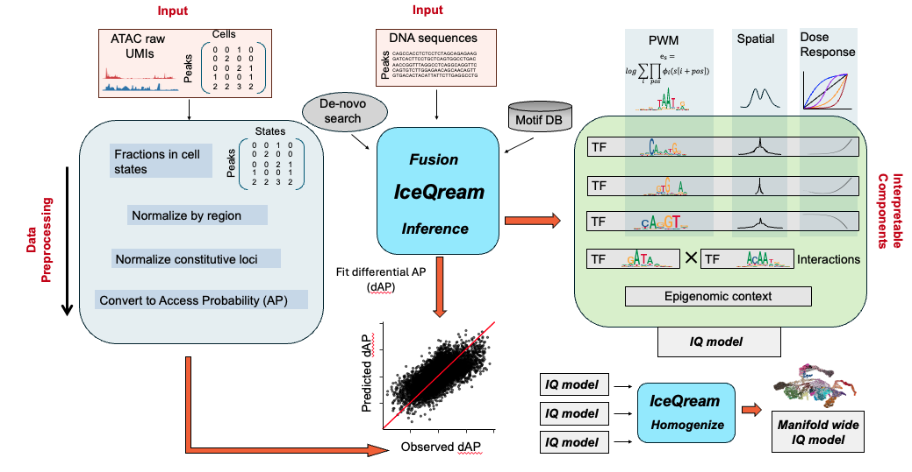

<!-- README.md is generated from README.Rmd. Please edit that file -->
# iceqream 

<!-- badges: start -->
[](https://lifecycle.r-lib.org/articles/stages.html#experimental) <!-- badges: end -->

`iceqream` (Interpretable Computational Engine for Quantitative Regression of Enhancer ATAC Motifs, in short: `IQ`) is a package for regressing accessibility from sequences using physical models of TF binding.

It models TF effective concentrations as latent variables that activate or repress regulatory elements in a nonlinear fashion, with possible contribution from pairwise interactions and synergistic chromosomal domain effects. IQ allows inference and synthesis of models explaining accessibility dynamics over an entire single cell manifold.



## Installation

You can install the development version of iceqream like so:

``` r
remotes::install_github("tanaylab/iceqream")
```

## Usage

See the [vignette](https://tanaylab.github.io/iceqream/articles/iceqream.html) for a detailed example on a mouse gastrulation trajectory.
